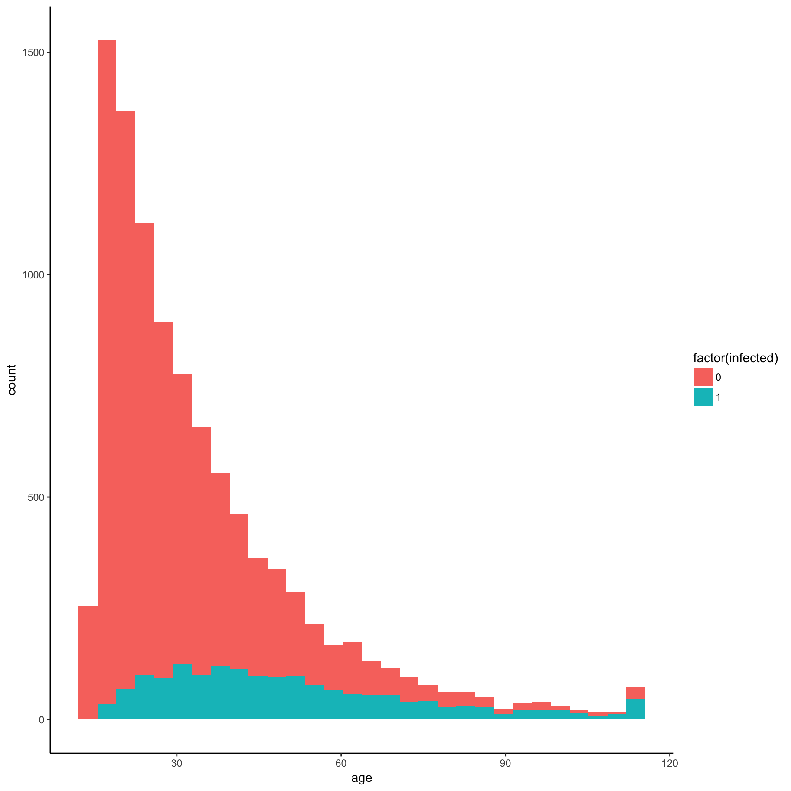

<!-- README.md is generated from README.Rmd. Please edit that file -->
<!-- using Rscript -e 'library(rmarkdown); rmarkdown::render("README.Rmd")' -->


`pilsner` : **P**atient **I**ndividual **L**evel **S**imulation, **N**on-interacting but **E**fficient, using **R**cpp

This uses `Rcpp` to provide a single function in R:

-   `simulator` : take an cohort and return the final state after a DES run (optionally, data on all events)

This implements a time-to-event discrete event simulation, assuming completely independent individuals. The user specifies the DES event logic in the simple file `src/eventlogic.cpp`, but need not worry about the simulation engine. More details are explained below.

### Installation

Because the simulation is specified in C++, the `Rcpp` R package must be installed:

``` {.r}
install.packages("ggplot2") # needed for the graph
install.packages("Rcpp") #needed to run the models
```

This may require reading the relevant package installation guidance pages and downloading a compiler. This will be system-dependent. On Mac or Linux, a working compiler probably already exists.

### Logic

The function `simulator` takes 6 arguments:

-   `AM` - a column-named matrix of inital age-like quantities (eg age, time-since-event), which will advance with time. 1 row per person
-   `CM` - a column-named matrix of initial continuous person characteristics. 1 row per person
-   `DM` - a column-named matrix of initial integer person characteristics (eg for sex etc). 1 row per person
-   `endtime` - when to stop the simulation
-   `parmzl` - a list of named vectors specifying parameters (either length 1, or length the cohort size)
-   `recording` - a boolean (default `FALSE`) specifying whether to record and return event data (will substantially slow the model down)

The `simulator` function acts by side-effect for speed, i.e. it will alter the supplied data. **NB** this can be dangerous if unwary, eg with repeated simulation. However, it does facilitate onward simulation.

The person objects created in the engine, with have accessible data accessible via the column names (see below). The nature of `parmzl` allows either PSA or individualized simulation parameters (again & see below, accessible by name in writing the logic).

### Usage

Having specified a model, we can load up the `Rcpp` package and compile it:

``` {.r}
library(Rcpp) # assuming in dir above src
sourceCpp('src/pilsner.cpp') #compiles: only needed once per session
```

Then specify some input data:

``` {.r}
NN <- 1e4 #cohort size
AM <- matrix(15,ncol=1,nrow=NN); colnames(AM) <- "age" # age data <0 will not be advanced
CM <- matrix(0,ncol=2,nrow=NN); colnames(CM) <- c("timeofdeath","timeofinfection")
DM <- matrix(1,ncol=2,nrow=NN); colnames(DM) <- c("alive","infected")
DM[,2] <- 0 #start uninfected
```

Here are some parameters, specified in a round about way, to illustrate both single and individualized parameter input data

``` {.r}
## parameter examples
PP <- data.frame(mu=rep(.05,NN),lambda=rep(0.01,NN),nu=rep(0.1,NN))
df2l <- function(x) lapply(split(x,1:nrow(x)),unlist) #fn for converting dataframe
PP0 <- list(unlist(PP[1,])) # take the top row as a parameter input
PPL <- df2l(PP) # split the whole dataframe into a list with separate parameter for everyone
```

Now we can run the model and examine the output:

``` {.r}
out <- simulator(AM,CM,DM,100,PPL,recording=FALSE) #returns by side effect
## 36236 events took place...in 0.070907 seconds.
out
##   recording turned off
## 1         0      0   0
summary(DM)
##      alive           infected     
##  Min.   :0.0000   Min.   :0.0000  
##  1st Qu.:0.0000   1st Qu.:0.0000  
##  Median :0.0000   Median :0.0000  
##  Mean   :0.0061   Mean   :0.1672  
##  3rd Qu.:0.0000   3rd Qu.:0.0000  
##  Max.   :1.0000   Max.   :1.0000
head(CM)
##      timeofdeath timeofinfection
## [1,]   13.309429        0.000000
## [2,]    5.108318        0.000000
## [3,]   10.370497        0.000000
## [4,]   38.884127        3.975055
## [5,]   18.822349        0.000000
## [6,]   13.483139        0.000000
head(AM)
##           age
## [1,] 28.30943
## [2,] 20.10832
## [3,] 25.37050
## [4,] 53.88413
## [5,] 33.82235
## [6,] 28.48314
```

Note again how this acts by side-effect. `out` contains a reminder that it is empty unless `recording=TRUE` (which slows things down). For this simple model, it ran at around half a million events per second on my desktop. Further speed-ups could probably be achieved by using GSL PRNGs for example.

Check by plotting:

``` {.r}
library(ggplot2)  # plotting library 
P <- ggplot(as.data.frame(cbind(AM,DM)),
      aes(x=age,fill=factor(infected))) +
  geom_histogram() + theme_classic()
print(P)  
```



The `recording=TRUE` option is only really intended for debugging. The idea is that any data that is actually wanted from the run for analysis (eg event counts, cumulative costs etc) should be recorded 'by the people', ie encoded in their data and updated during events. Before running again - this time with `recording` turned on - we need to reset the data:

``` {.r}
AM[,1] <- 15 # resetting data 
CM[,1] <- CM[,2] <- 0
DM[,1] <-1; DM[,2] <- 0 
out <- simulator(AM,CM,DM,100,PPL,recording=TRUE) #
## 36235 events took place...in 0.112529 seconds.
out[(NN-5):(NN+5),]
##              time      event  who
## 9995  0.000000000 initialize 8188
## 9996  0.000000000 initialize 8189
## 9997  0.000000000 initialize 2047
## 9998  0.000000000 initialize 8190
## 9999  0.000000000 initialize 4095
## 10000 0.000000000 initialize 8191
## 10001 0.001439965        die 1579
## 10002 0.002666722        die 3767
## 10003 0.002846548        die 8156
## 10004 0.003764989     infect 2232
## 10005 0.005101420        die 4439
```

The object returned now contains details of the events to check behaviour is as expected. This should probably be changed to include internal data from people also (which is currently gathered in this mode but not formatted for output).

### Model specification

TODO

### TODO list

-   more thorough checking for bugs
    -   think bug if initial ages are ==0?
    -   check event times can't be past end time
-   inclusion of more output for `recording=TRUE`
-   get GSL PRNGs working and benchmark
-   openmp: split into different event queues, 1 per core

### Warning

There are indubitably bugs -- this isn't fully tested. Feedback and corrections most welcome!

### License

1.  P.J. Dodd (2018): Distributed under CC BY 4.0 license <https://creativecommons.org/licenses/by/4.0/>
